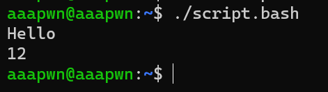

## Linux Scripting
 การทำงานในแบบ Command-line interopreter ผ่าน Shell ทำงานได้เปรียบเสมือนภาษา program ชนิดหนึ่ง Script ช่วยให้ผู้ใช้งานสามารถทำงานได้รวดเร็วมากยิ่งขึ้น โดยการรวมเอาคำสั่งและเงื่อนไขที่ผู้ใช้ต้องการใส่ลงใน file และทำการ execute file นั้นเพื่อรอผลลัพธ์ที่ได้ในรูปแบบ text โดยส่วนมากใช้งานเพื่อให้ทำงานบนระบบอัตโนมัติตามเวลาที่เราต้องการ

## ประโยชน์ของ Linux Script
1. **เป็นตัวย่อคำสั่ง** script ช่วยให้ง่ายต่อการใช้งานระบบมากขึ้น ด้วยการกำหนดค่า environment รวมถึง คำสั่งต่างที่ต้องทำ รวมเข้าไปใว้ใน script เดียวแต่ยังทำงานเหมือนคำสั่ง unix ปกติ
	```
	#!/bin/sh

	clear
	ls -al
	```
2.  **รวบรวมชุดคำสั่ง** งานที่ต้องรันคำสั่งซ้ำๆกันหลายครั้ง หรือ batch job สามารถรวบรวมเข้าเป็น Shell script เพื่อให้ระบบค่อยๆทำงานทีละชุดคำสั่งไปเรื่อยๆเอง แทนที่จะต้องมาคอยรันคำสั่งเองที่ละบรรทัด
	```
	#!/bin/csh
	echo compiling...
	gcc -c foo.c
	gcc -c bar.c
	gcc -c qux.c
	gcc -o myprog foo.o bar.o qux.o
	echo done.
	```
3. **การใช้งานทั่วไป** นอกจาก batch job ที่ทำงานแบบซ้ำๆแล้ว เราสามารถนำเอา shell loop มาใช้ทำงานให้มีความสะดวกยิ่งขึ้น
	```
	#!/bin/bash
	
	i=1
	while [ $i -le 10 ]; do
		echo  "$i"
		i=$((i+1)) 
	done
	```

## วิธีการเขียน script เบื้องต้น
### การสร้างและเรียกใช้ script
- การสร้าง script
	1. สร้างไฟล์โดยใช้ nano เช่น ```nano script.bash```
	2. ใส่ ```#!/bin/bash``` หรือ ```#!/bin/sh``` เพื่อบอกให้รู้ว่า script นี้ควรจะถูก execute ด้วย bash หรือ sh
	3. ใส่เนื้อหา script
	4. ```ctrl+O``` เพื่อทำการบันทึก script
- วิธีการเรียกใช้ script
	สามารถเรียกใช้ โดยพิมพ์ชื่อไฟล์ script ตาม pathname ได้เลย เช่น ```./script.bash```
### การแสดงข้อความ
เราสามารถแสดงข้อความได้โดยการใช้ ```echo``` เช่น ต้องการจะแสดงคำว่า "Hello World" ออกทางหน้าจอ
```
#!/bin/bash

echo "Hello World"
```


### กำหนดสิทธิ์ในการเรียกใช้ script
ไฟล์ script ที่เพิ่งสร้างมา จะยังไม่สามารถเรียกใช้ได้ โดยจะขึ้นว่า `Permission denied`

โดยสามารถเปลี่ยน Permission ได้โดยใช้คำสั่ง `chmod [ u / g / o ][ + / - ][ r / w / x] filename` โดยแต่ละตัวมีความหมายดังนี้
|ตัวอักษร|ประเภท|ความหมาย|
|---|---|---|
|u|ประเภทผู้ใช้|เจ้าของไฟล์|
|g|ประเภทผู้ใช้|กลุ่มของผู้ใช้|
|o|ประเภทผู้ใช้|ผู้ใช้อื่นๆ|
|+|การเพิ่มสิทธิ์|เพิ่มสิทธิ์ของผู้ใช้|
|-|การลดสิทธิ์|ลดสิทธิ์ของผู้ใช้|
|r|สิทธิ์ของผู้ใช้|สิทธิ์ในการอ่าน|
|w|สิทธิ์ของผู้ใช้|สิทธิ์ในการเขียน|
|x|สิทธิ์ของผู้ใช้|สิทธิ์ในการเรียกใช้(execute)|
#### ตัวอย่าง
`chmod u+x example.bash` เพิ่ม(+)สิทธ์ในการ execute(x) ไฟล์ example.bash ให้กับเจ้าของไฟล์(u)


### ตัวแปรใน script
เราสามารถตั้งค่าตัวแปรใน script ได้ โดย syntax จะเป็น ```variable=value``` โดยห้ามมี white space ระหว่างเครื่องหมายเท่ากับ เนื่องจากโปรแกรมจะถือว่าช่องว่างเป็นตัวแบ่ง argument
และเราสามารถเรียกใช้ตัวแปรที่เราสร้างได้โดยการใช้ ```$``` ตามด้วยชื่อตัวแปร

```
#!/bin/bash

val1="Hello"
val2=12

echo $val1
echo $val2
```


### การ Comment
การ Comment เราสามารถใส่ `#` แล้วตามด้วยข้อความที่ comment ได้ เช่น
```
#!/bin/bash

# show hello world on display
echo "hello world"
```


### Array
สามรถสร้างตัวแปรแบบ array ใน script ได้โดยการใช้วงเล็บ แล้วตามด้วยสมาชิกข้างใน array
```
#!/bin/bash
# file: script.bash

animal=(cat dog fish)

echo $animal
echo $animal[2]
echo ${animal[0]}
echo ${animal[1]}
echo ${animal[2]}
echo ${animal[@]}
``` 


จะเห็นได้ว่า สามารถเรีกใช้ได้ โดยถ้าเรียกใช้ตัวแปรประเภท array แบบไม่กำหนด index ค่าที่ออกมาจะเป็นสมาชิกตัวแรกใน array แต่ถ้าหากต้องการจะเรียกใช้โดยกำหนดก็สามารถทำได้ แต่ต้องใช้ {} ครอบชื่อตัวแปร และถ้าหากต้องการจะเรียกดูสมาชิกทั้งหมด ให้ระบุตำแหน่ง index เป็น `@`

### Operator
#### Operator เกี่ยวกับ Integer
|syntax|ความหมาย|
|---|---|
|`int1 -eq int2`|เช็คว่า int1 มีค่าเท่ากับ int2 หรือไม่|
|`int1 -ne int2`|เช็คว่า int1 มีค่าไม่เท่ากับ int2 หรือไม่|
|`int1 -gt int2`|เช็คว่า int1 มีค่ามากกว่า int2 หรือไม่|
|`int1 -ge int2`|เช็คว่า int1 มีค่ามากกว่า หรือ เท่ากับ int2 หรือไม่|
|`int1 -le int2`|เช็คว่า int1 มีค่าน้อยกว่า int2 หรือไม่|
|`int1 -lt int2`|เช็คว่า int1 มีค่าน้อยกว่า หรือ เท่ากับ int2 หรือไม่|

#### Operator เกี่ยวกับ String
|syntax|ความหมาย|
|---|---|
|`str1 = str2`|เช็คว่า str1 เหมือนกับ str2 หรือไม่ <br> (จะสังเกตได้ว่ามี white space ระหว่างเครื่องหมายเท่ากับ)|
|`str1 != str2`|เช็คว่า str1 ไม่เหมือนกับ str2 หรือไม่|
|`str`|เช็คว่า str ไม่ใช่ค่าว่างใช่หรือไม่|
|`-n str`|เช็คว่า str มีความยาวมากกว่า 0 ใช่หรือไม่|
|`-z str`|เช็คว่า str มีความยาวเป็น 0 ใช่หรือไม่|

#### Operator เกี่ยวกับ File
|syntax|ความหมาย|
|---|---|
|`-d filename`|เช็คว่า filename เป็น directory หรือไม่|
|`-f filename`|เช็คว่า filename เป็น file หรือไม่|
|`-r filename`|เช็คว่า filename อ่านได้หรือไม่|
|`-w filename`|เช็คว่า filename สามารถเขียนได้หรือไม่|
|`-x filename`|เช็คว่า filename สามารถ execute ได้หรือไม่|
|`-s filename`|เช็คว่า filename มีขนาดเป็น 0 หรือไม่|

#### คำสั่งเกี่ยวกับ logical
|syntax|ความหมาย|
|---|---|
|`!exp`|`not` exp|
|`exp1 -a exp2`|exp1 `and` exp2|
|`exp1 -o exp2`|exp1 `or` exp2|

### If
รูปแบบเงื่อนไขใน script จะเป็นรูปแบบ `if-then-else` ซึ่งจะมีความหมายหมายว่า (if)ถ้าเงื่อนไขเป็นจริง (then)จะให้ทำตามคำสั่ง a (else)ถ้าไม่เป็นจริง ให้ทำตามคำสั่ง b
```
if [ expression ]
then
    commands
elif [ expression ]
then
    commands
else
    commands
fi
```
โดย `fi` จะเป็นการบอกว่า จบคำสั่งเช็คเงื่อนไข และต้องมี white space ระหว่าง expression และวงเล็บเสมอ

#### ตัวอย่าง
```
#!/bin/bash
# file: script.bash

num1=1
num2=1

if [ $num1 -eq $num2 ]
then
    echo "num1 is equal to num2"
else
    echo "num1 is not equal to num2"
fi
```


### While loop
while loop เป็นคำสั่งในการทำซ้ำของโปรแกรม โดยจะทำซ้ำจนกว่าเงื่อนไขจะเป็นเท็จ
```
while [ expression ]
do
    commands
Done
```
โดยจาก syntax ข้างต้น คำสั่ง while จะทำซ้ำ commands ไปจนกว่า expression จะเป็นเท็จ
#### ตัวอย่าง
```
#!/bin/bash
# file: script.bash

i=1

while [ $i -le 10 ]
do
        echo $i
        ((i=$i+1))
done
```


### For loop
for loop เป็นคำสั่งในการทำซ้ำของโปรแกรมคล้ายคลึงกับ while loop แต่รูปแบบการเขียนจะไม่เหมือนกัน
```
for var in list
do
 commands
Done 
```
#### ตัวอย่าง
```
#!/bin/bash
# file: script.bash

student=(arm sila bamboo gus balloon)

for i in ${student[@]}
do
    echo $i
done
```


## ความแตกต่างระหว่าง `#!/bin/sh` และ `#!/bin/bash`
**sh** หรือ **shell** เป็นภาษาโปรแกรมเชลล์สำหรับระบบที่ใช้ UNIX โดยทุกสิ่งที่พัฒนาโดยใช้เชลล์สามารถใช้ในระบบปฏิบัติการอื่นได้เช่นกัน ส่วน **bash** จะเป็น shell ที่ถูกพัฒนาเพิ่มขึ้นโดย GNU ซึ่งจะมีคุณลักษณะของเชลล์ทั้งหมด แต่ได้พัฒนาส่วนขยายที่ดีขึ้น โดยสิ่งหลัก ๆ ที่เพิ่มขึ้นมาจะมี
- การกำหนดขอบเขตตัวแปร
- Array
- ตัวแปรพิเศษ เช่น $RANDOM, $SECONDS เป็นต้น
### ตัวอย่าง
```
# file: script.bash

num=(1 2 3 4 5)
echo ${num[2]}

echo "------------"
echo $RANDOM
echo $SECONDS
```
#### execute ด้วย bash (`#!/bin/bash`)


#### execute ด้วย sh (`#!/bin/sh`)


ซึ่งจะสังเกตว่า แม้แต่นามสกุลไฟล์เป็น `.bash` แต่ถ้าบรรทัดแรกสุดของไฟล์ได้กำหนดให้ execute ด้วย `sh` script จะถูก execute ด้วย `sh` ไม่ใช่ `bash`

## Reference
 1. https://saixiii.com/what-is-shell-script/
 2. https://ftp.psu.ac.th/pub/howto/bash-howto/Shell%20Script.pdf
 3. https://en.wikipedia.org/wiki/Chmod#:~:text=In%20Unix%20and%20Unix-like,objects%20(files%20and%20directories).
 4. https://th.linux-console.net/?p=15264
