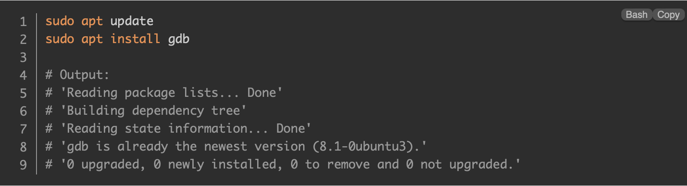
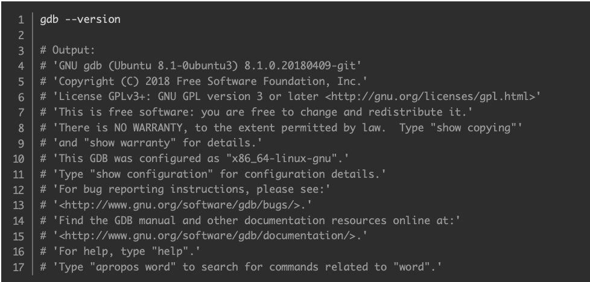

# Debugger

สำหรับคำว่า "Debugger"  นั้นมีอยู่ด้วยกัน 2  ความหมาย คือ บุคคลที่ทำหน้าที่แก้ไข Bug  ภายในระบบ และอุปกรณ์ที่ใช้ในการ Debugging (Debugger Tools)  ที่ช่วยทุ่นแรงของ Developer  ในการระบุปัญหาและดำเนินการแก้ไขข้อผิดพลาดในระบบ (Bug)  ที่พบได้บ่อย ๆ ช่วยประหยัดเวลาการทำงานของผู้พัฒนา (Developer)  ในการนั่งไล่อ่านโค้ดทีละบรรทัดเพื่อปรับแก้
# Debugger คืออะไร

**Debugger**  เป็นเครื่องมือซอฟต์แวร์ที่ Developer ใช้เพื่อระบุและแก้ไขปัญหาในโปรแกรมคอมพิวเตอร์ มีสภาพแวดล้อมที่มีการควบคุมสําหรับการตรวจสอบและวิเคราะห์การดําเนินการของโปรแกรม ทําให้ Developer เข้าใจพฤติกรรมของโค้ดและวินิจฉัยปัญหาได้  Debug เกอร์เป็นสิ่งจําเป็นสําหรับการพัฒนาซอฟต์แวร์ ช่วยปรับปรุงกระบวนการ Debug และปรับปรุงคุณภาพโค้ดโดยรวม

**Debugger** มีคุณสมบัติหลายอย่าง เช่น

**Breakpoints:**

Developer สามารถตั้งค่า Breakpoint ที่บรรทัดเฉพาะของโค้ดหรือเงื่อนไขที่เมื่อมีการ trigger จะหยุดการทํางานของโปรแกรมชั่วคราว สิ่งนี้ทําให้สามารถตรวจสอบสถานะของโปรแกรมได้อย่างรอบคอบ ณ จุดนั้น ๆ

**Stepping:**

Debugger มีตัวเลือกสําหรับการทำให้ Code ทำงานทีละบรรทัด ทําให้ Developer สามารถดําเนินการโปรแกรมทีละบรรทัดได้ สิ่งนี้ช่วยในการทําความเข้าใจขั้นตอนการดําเนินการและการระบุปัญหาได้ดียิ่งขึ้น

**Variable Inspection:**

Developer สามารถตรวจสอบค่าของตัวแปรและโครงสร้างข้อมูลที่จุดต่างๆ ระหว่างการดําเนินการของโปรแกรม นี่เป็นสิ่งสําคัญสําหรับการทําความเข้าใจว่าข้อมูลถูกจัดการอย่างไรและระบุค่าที่ไม่ถูกต้องหรือพฤติกรรมที่ไม่คาดคิด

**Watchpoints:**

Watchpoints ช่วยให้ Developer สามารถติดตามการเปลี่ยนแปลงของตัวแปรเฉพาะได้ เมื่อค่าของตัวแปรที่เฝ้าดูได้รับการแก้ไข Debugger จะหยุดการดําเนินการชั่วคราว แล้วจึงเปิดใช้งานการตรวจสอบโดยละเอียด

**Call Stack Inspection:**

Debugger จัดเตรียมการเรียกใช้ Stack ซึ่งแสดงลําดับของการเรียกฟังก์ชันที่นําไปสู่จุดดําเนินการปัจจุบัน สิ่งนี้ช่วยระบุห่วงโซ่ของเหตุการณ์ที่นําไปสู่ข้อบกพร่องหรือข้อผิดพลาด

**Memory Inspection:**

Debugger มักจะให้ความสามารถในการตรวจสอบหน่วยความจํา ทําให้ Developer สามารถตรวจสอบเนื้อหาของตําแหน่งหน่วยความจําได้ สิ่งนี้มีประโยชน์สําหรับการระบุปัญหาที่เกี่ยวข้องกับหน่วยความจํา เช่น การมี Buffer ล้น หรือหน่วยความจํารั่วไหล

**Conditional Breakpoints:**

นอกเหนือจาก Breakpoint มาตรฐานแล้ว Developer สามารถตั้งค่า Breakpoint แบบมีเงื่อนไขตามเงื่อนไขเฉพาะ หรือ expressions การดําเนินการของโปรแกรมจะหยุดชั่วคราวก็ต่อเมื่อเงื่อนไขประเมินเป็นจริง ทําให้สามารถ Debug เป้าหมายได้

**Post-Mortem Analysis:**

Advanced debuggers  บางตัวรองรับ  post-mortem analysis  ทําให้ Developer สามารถตรวจสอบสถานะของโปรแกรมที่ขัดข้องหรือถูกยกเลิกได้ สิ่งนี้ช่วยในการทําความเข้าใจสาเหตุ  และการวินิจฉัยปัญหา

# คำสังที่ใช้ในการ  Debugger

## GNU Debugger (GDB)

GDB ย่อมาจาก GNU Project Debugger และเป็นเครื่องมือ Debug สําหรับ C (พร้อมกับภาษาอื่นๆ เช่น C++) มันช่วยให้สามารถเข้าไปข้างในโปรแกรม C ในขณะที่กำลัง executing และยังช่วยให้เห็นว่าจะเกิดอะไรขึ้นเมื่อโปรแกรมขัดข้อง GDB ทํางานบน executable files ซึ่งเป็นไฟล์ Binary ที่ผลิตโดย Compilation process

# การใช้งาน

## การติดตั้งการใช้งาน GDB

ใช้คำสั่ง

`sudo apt update`

เพื่อ Update รายการ Packets ที่มีอยู่

ต่อมาใช้คำสั่ง

`sudo apt install gdb`

เพื่อติดตั้ง Packets gdb

> ที่มา: https://ioflood.com/blog/install-gdb-command-linux/

เช็ค Version และความพร้อมในการใช้งาน

> ที่มา: https://ioflood.com/blog/install-gdb-command-linux/

 ## เริ่มต้นgdb

`GDB`

> ที่มา: https://www.geeksforgeeks.org/gdb-step-by-step-introduction/

ในการใช้คำสั่งนี้ Gdb open prompt  จะมีการแจ้งให้ทราบว่าพร้อมสําหรับการใช้คําสั่งแล้ว 
## หากต้องการออกจาก gdb 

`quit`

or

`q`

> ที่มา: https://www.geeksforgeeks.org/gdb-step-by-step-introduction/

## เรียกใช้ GDB ด้วย generated executable

`gdb ./test`

> ที่มา: https://www.geeksforgeeks.org/gdb-step-by-step-introduction/

## Useful GDB commands:

commands เบื้องต้นเพื่อใช้ GDB.
| **Command** |  **Description**|
|--|--|
| **`run`or `r`** |Run โปรแกรมตั้งแต่ต้นจนจบ  |
|**`break` or `b`**|ตั้งค่าbreakpoint บนบรรทัดใดบรรทัดหนึ่ง|
|**`disable`**|ปิดใช้งานbreakpoint|
|**`enable`**|เปิดใช้งาน breakpoint ที่ปิดใช้งาน|
|**`next` or `n`**|ทำประโยคคำสั่งที่อยู่ถัดไปในโค้ดแล้วหยุดชั่วคราว แต่ถ้ามีการเรียกใช้ฟังก์ชัน ก็จะทำจนจบการทำงานของฟังก์ชันดังกล่าว|
|**`step`**|ทำประโยคคำสั่งที่อยู่ถัดไปในโค้ดแล้วหยุดชั่วคราว ถ้ามีการเรียกฟังก์ชันในซอร์สโค้ด ให้เข้าไปทำประโยคคำสั่งข้างในฟังก์ชันแล้วหยุดที่ประโยคคำสั่งแรกของฟังก์ชัน|
|**`list` or `l`**|แสดงโค้ดภาษา  **C**  ที่เกี่ยวข้อง และสามารถระบุช่วงหมายเลขบรรทัดได้ เช่น  `list 1,5`  แสดงโค้ดตั้งแต่บรรทัด 1 ถึง 5|
|**`print` or `p`**|แสดงค่าตัวแปร|
|**`quit` or `q`**|ออกจากGDB|
|**`clear`**|ล้าง breakpoints ทั้งหมด|
|**`continue`**|ดำเนิน execution แบบปกติ|

## หน้าจอการ Debug

- เพื่อแสดง code ใช้คำสัง `l`

> ที่มา: https://www.geeksforgeeks.org/gdb-step-by-step-introduction/

- ตั้งค่า Breakpoint ใช้คำสัง `b`

> ที่มา: https://www.geeksforgeeks.org/gdb-step-by-step-introduction/

- ดู Breakpoint ใช้คำสัง  `info b`

> ที่มา: https://www.geeksforgeeks.org/gdb-step-by-step-introduction/

- ปิดใช้งาน Breakpoint ใช้คำสัง ` disable b`

> ที่มา: https://www.geeksforgeeks.org/gdb-step-by-step-introduction/

- เปิดใช้งาน Breakpoint ที่ Disable ไว้ ใช้คำสัง ` enable b`

> ที่มา: https://www.geeksforgeeks.org/gdb-step-by-step-introduction/

- Run the code ใช้คำสั่ง `r`

> ที่มา: https://www.geeksforgeeks.org/gdb-step-by-step-introduction/

- print ค่าตัวแปรใช้คำสั่ง `p`

> ที่มา: https://www.geeksforgeeks.org/gdb-step-by-step-introduction/

## Debugging output
ภาพหน้าจอด้านล่างแสดงค่าของตัวแปรซึ่งค่อนข้างเข้าใจได้ว่าผลลัพธ์ที่เกิดขึ้น ในทุกการดําเนินการของ ./test  เราจะได้รับผลลัพธ์ที่แตกต่างกัน

> ที่มา: https://www.geeksforgeeks.org/gdb-step-by-step-introduction/

## บทสรุป

GDB (GNU Debugger)  ซึ่งเป็นเครื่องมือใน Linux  ที่ใช้สําหรับการ Debug โปรแกรม C เราสามารถ Compile โค้ดด้วยข้อมูลการ Debug เรียกใช้ GDB  ตั้งค่า Breakpoint ตรวจสอบตัวแปร และวิเคราะห์พฤติกรรมของโปรแกรม i;,รวมถึงได้กล่าวถึงคุณสมบัติของ GDB  เช่น การตรวจสอบโค้ด การจัดการ Breakpoint การจัดการตัวแปร และการควบคุมการดําเนินการของโปรแกรม ซึ่งช่วยให้เราสามารถ Debug และแก้ไขปัญหาได้อย่างมีประสิทธิภาพ

## References

- https://iot-kmutnb.github.io/blogs/training/gcc_linux/

- https://www.geeksforgeeks.org/gdb-step-by-step-introduction/

- https://www.scaler.com/topics/linux-debugger/

- https://tips.thaiware.com/2059.html

- https://ioflood.com/blog/install-gdb-command-linux/

- https://www.cherryservers.com/blog/sudo-apt-update#:~:text=The%20sudo%20apt%20update%20command%20is%20a%20Linux%2FDebian%20system,in%20the%20system%27s%20package%20index.

